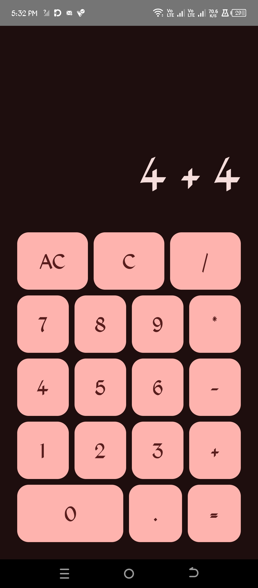
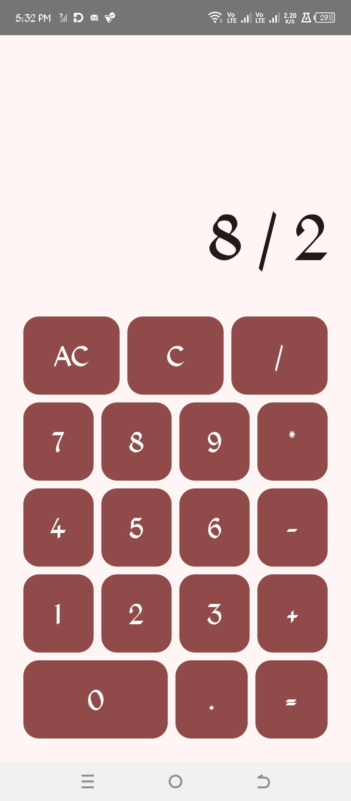
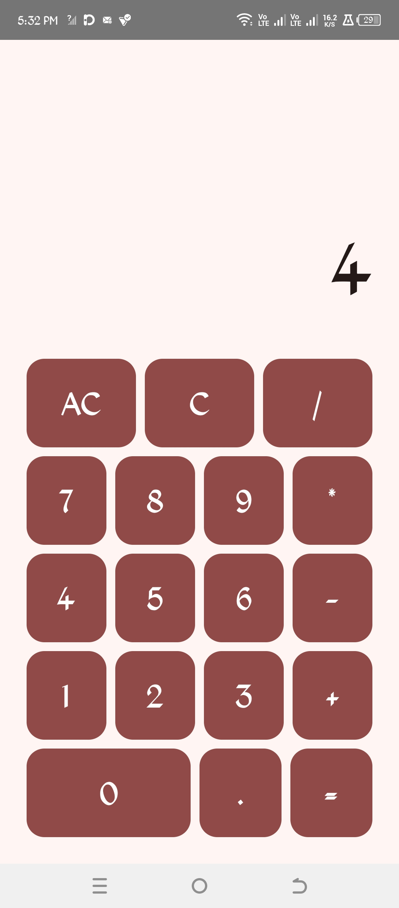

# Calculator App

This is a basic addition calculator application developed using Android.

## Setup Instructions

1.  **Clone the repository:**
    ```bash
    git clone git@github.com:Trailblazer-dev/Calculator_app.git
    cd Calculator_app
    ```
2.  **Open in Android Studio:**
    Open the project in Android Studio. It should automatically sync dependencies.

3.  **Run the application:**
    You can run the application on an emulator or a physical Android device from Android Studio.

## Features

*   Performs addition operations.

## Technologies Used

*   Kotlin
*   Android Jetpack Compose
*   Gradle

## Screenshots

### Addition (4 + 4)


### Addition Answer (8)


### Division (8 / 2)


### Division Answer (4)
